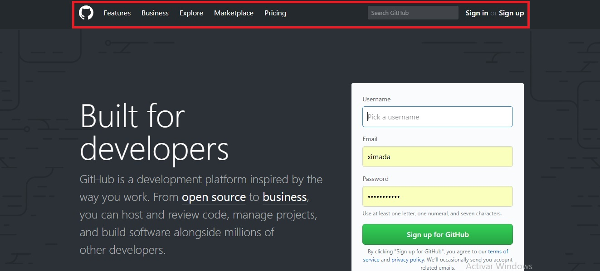
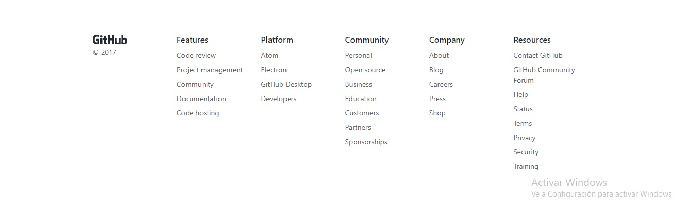
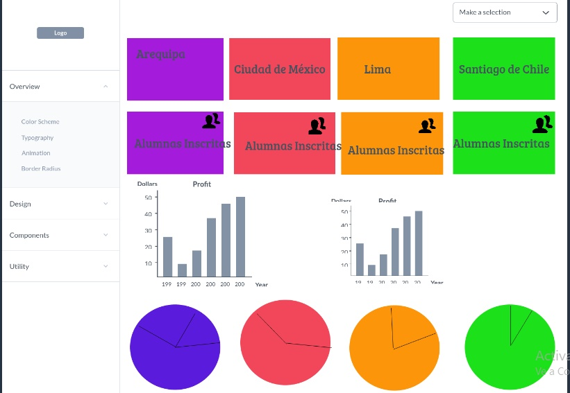

 1. Sobre la web de *Laboratoria*: explica qué partes conforman el UX y qué partes el UI
 ### UX:
  * Objetivos de  negocio: que se postulen  mas  mujeres, que empresas contraten y que  contraten servicios de capacitación  que ofrece laboratoria
  * Para el caso de el objetivo de negocio de alumnas: Empatia, confianza, interes ilusión por tranformar tu vida.
  * Para el caso de el objetivo de negocio de Empresas: Confianza, profesionalismo, responsabilidad.

 ### UI:
  * Paleta de Colores
  * Botones con Elces
  * Imagenes
  * Iconos de redes Sociales
  * Tipos y Tamaños de letra
  * Enlaces
  * Datos relevantes tamaño de los testos contenidos en lo parrafos
  * Iconos y tamaño de empresas Aliadas

 2. Identifica los elementos de navegación de: *Github*
 ### Navegación Global
 
 ### Navegación Pie de pagina
  

3. Crea un *sketch* para la herramienta del dashboard de Laboratoria.
###  Dashboard de Laboratoria

